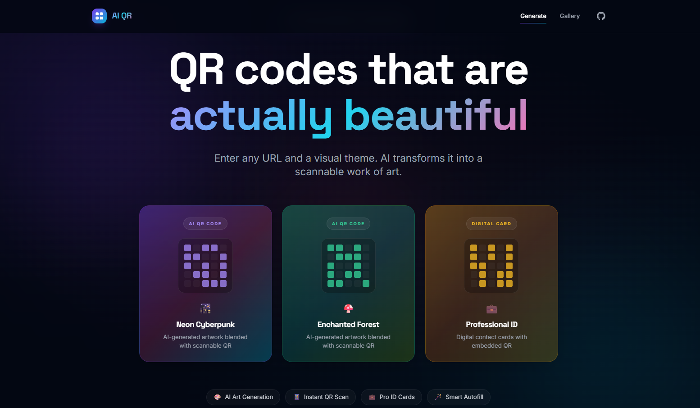
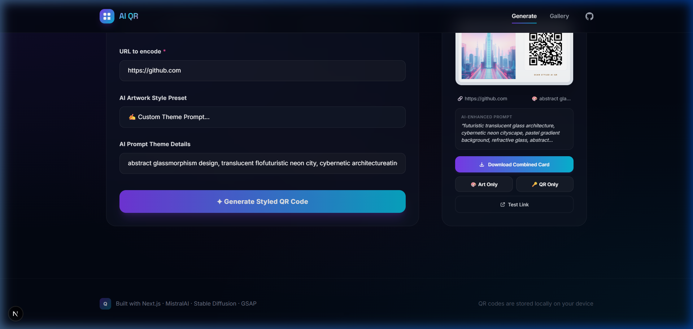
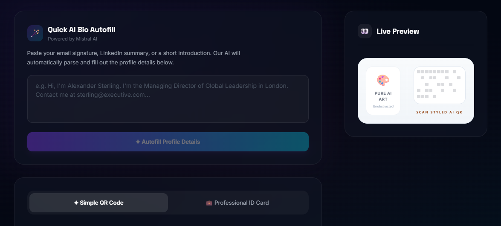
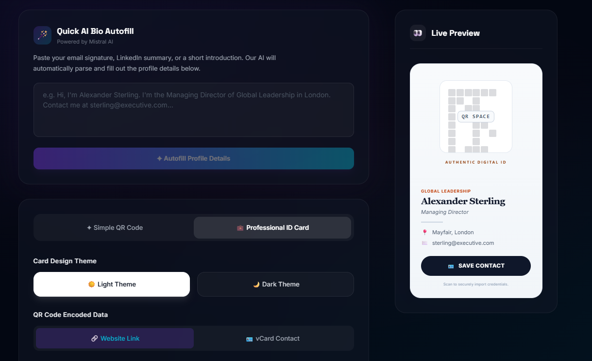
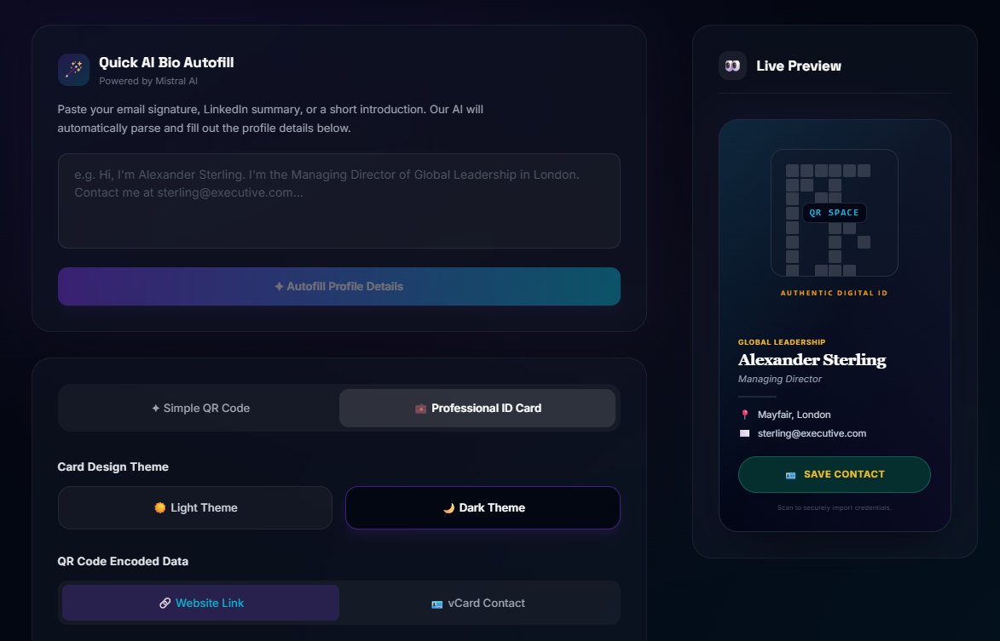
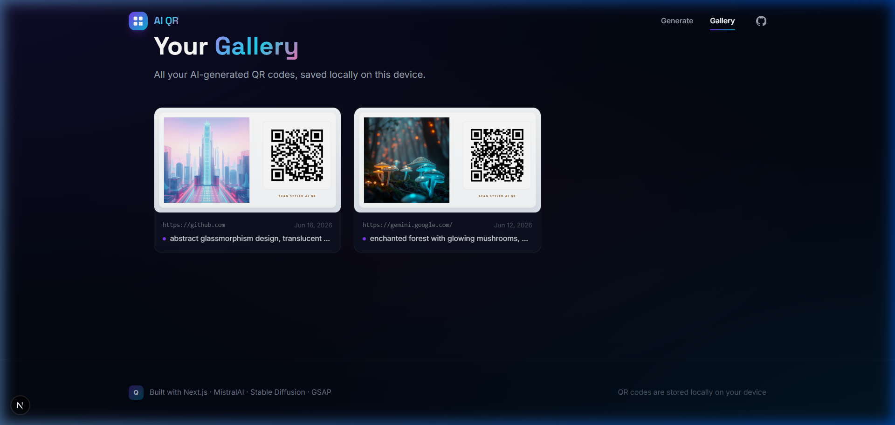

# AI-QR — Artistic AI QR Code Generator

AI-QR is a modern Next.js application that generates **artistic, scannable QR codes** blended with AI-generated artwork. By combining traditional QR code matrices with Diffusion models via Hugging Face and Mistral AI, it creates visually striking QR codes tailored to your custom textual prompts.

---

## Features

- **Artistic QR Code Generation**: Blend standard URL QR codes with generative AI prompts (e.g., *cyberpunk city*, *watercolor painting*, *isometric architecture*).
- **ControlNet Precision**: Uses advanced AI mapping to ensure the resulting artwork remains fully scannable by mobile devices.
- **Preconfigured Styles**: Choose from a list of predefined artistic styles or define your own.
- **Gallery**: View history of previously generated QR codes.
- **Polished UI**: Built with Next.js App Router, Tailwind CSS, and smooth animations using GSAP.

---

## Application Previews

### 1. Landing Page / Creator Dashboard
When launching the application, users are greeted with a dark-themed, premium design interface featuring the QR code creation panel.



### 2. Generation & AI QR Code Result
Once you input your target URL and prompt, click **Generate Styled QR Code**. The application processes the request through the Hugging Face AI pipeline (e.g., using ControlNet models) and renders the resulting scannable QR code.

Below are different styles of generated QR codes:

| AI QR Code (Artistic/Scenic) | Simple AI QR Code |
| :---: | :---: |
|  |  |

| Professional ID Card (Light Style) | Professional ID Card (Dark Style) |
| :---: | :---: |
|  |  |

### 3. QR Gallery
Navigate to `/gallery` to browse the collection of previously generated artistic QR codes.



---

## Tech Stack

| Layer | Choice |
|---|---|
| **Framework** | Next.js 15 (App Router), React 19, TypeScript |
| **Styling** | Tailwind CSS (v3), PostCSS, Autoprefixer |
| **Animations** | GSAP (GreenSock Animation Platform) + `@gsap/react` |
| **Artistic AI Pipeline** | Hugging Face Inference API (`@huggingface/inference`) |
| **LLM Processing** | Mistral AI Integration (`@langchain/mistralai`) |
| **QR Engine** | Node `qrcode` + `sharp` for image blending |

---

## Local Development Setup

### 1. Prerequisites
Ensure you have **Node.js (v18+)** and **npm** installed on your system.

### 2. Clone the Repository
Clone or navigate to the project root directory:
```bash
cd D:\Projects\AI-QR
```

### 3. Environment Configuration
Create a `.env.local` file at the root of the project:
```bash
cp .env.example .env.local
```
Add your API credentials:
```env
MISTRAL_API_KEY=your_mistral_api_key_here
HF_TOKEN=your_hugging_face_token_here
```
*(Make sure your Hugging Face token has access to execute serverless inference).*

### 4. Install Dependencies
Install all package dependencies:
```bash
npm install
```

### 5. Launch the Development Server
Run the local next server:
```bash
npm run dev
```
Open [http://localhost:3000](http://localhost:3000) in your browser to view the application.

### 6. Build for Production
To compile a optimized production build:
```bash
npm run build
npm start
```
