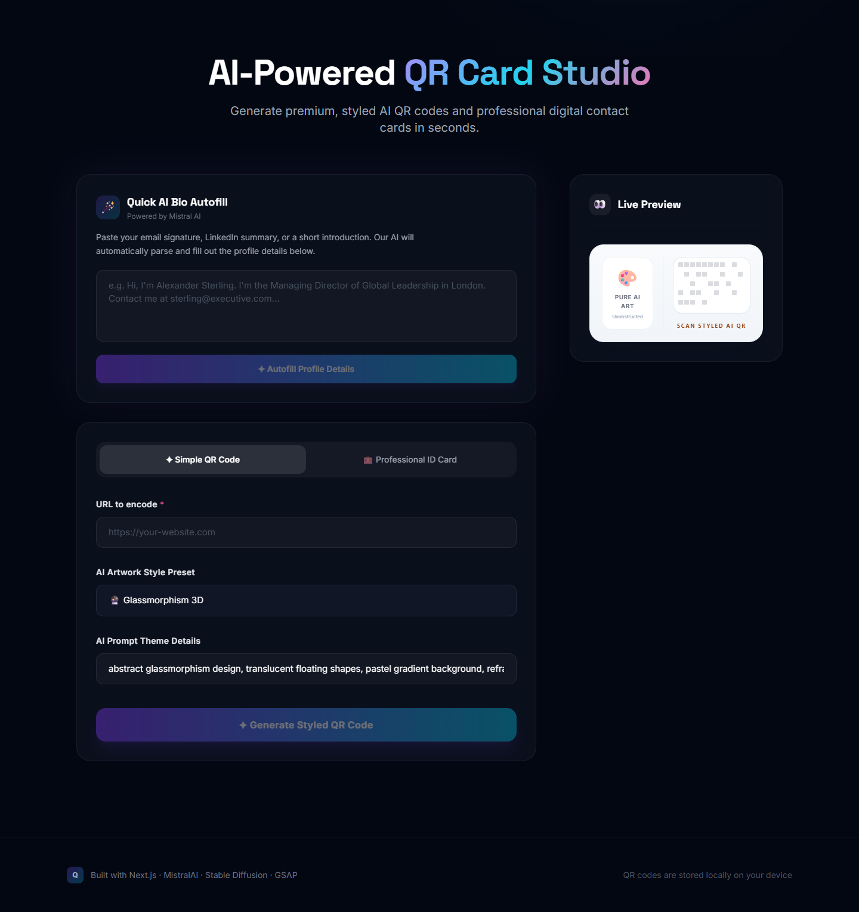
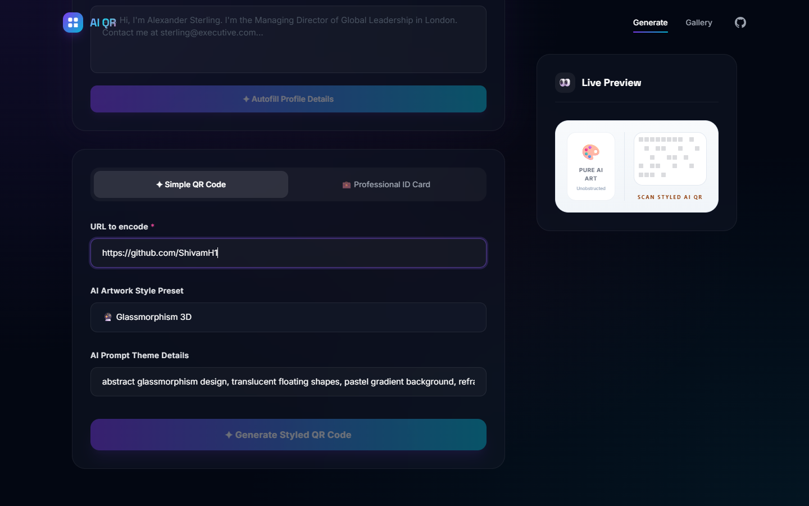
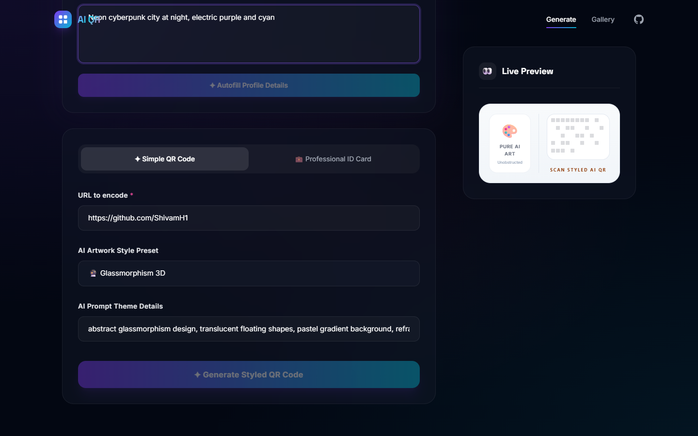
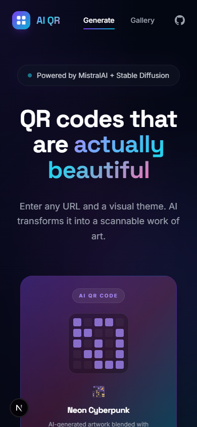

# AI-QR — Artistic AI QR Code Generator

AI-QR is a modern Next.js application that generates **artistic, scannable QR codes** blended with AI-generated artwork. By combining traditional QR code matrices with Diffusion models via Hugging Face and Mistral AI, it creates visually striking QR codes tailored to your custom textual prompts.

---

## Features

- **Artistic QR Code Generation**: Blend standard URL QR codes with generative AI prompts (e.g., _cyberpunk city_, _watercolor painting_, _isometric architecture_).
- **ControlNet Precision**: Uses advanced AI mapping to ensure the resulting artwork remains fully scannable by mobile devices.
- **Preconfigured Styles**: Choose from a list of predefined artistic styles or define your own.
- **Gallery**: View history of previously generated QR codes.
- **Polished UI**: Built with Next.js App Router, Tailwind CSS, and smooth animations using GSAP.

---

## Application Previews

### 1. Hero Section

The animated landing page features a dark premium design with glowing orbs, a gradient headline, preview QR style cards, and a smooth entrance animation.


### 2. Generator Form — Full View

Below the hero, the AI QR Card Studio panel lets you paste a URL, choose an art preset, and customize your AI prompt. A live preview card updates on the right.



### 3. URL & Theme Input

Enter your target URL and define the visual style prompt for the AI art pipeline.

|                     URL Input                      |                      Theme Input                       |
| :------------------------------------------------: | :----------------------------------------------------: |
|  |  |

### 4. QR Gallery

Browse previously generated artistic QR codes at `/gallery`.


### 5. Sample Generated QR Codes

Examples of AI-styled QR codes produced by the app:

|            AI QR Code (Artistic/Scenic)             |                   Simple AI QR Code                   |
| :-------------------------------------------------: | :---------------------------------------------------: |
|  |  |

|                    Professional ID Card (Light Style)                    |                      Professional ID Card (Dark Style)                      |
| :----------------------------------------------------------------------: | :-------------------------------------------------------------------------: |
|  |  |

### 6. Mobile Responsive

The entire experience scales to mobile viewports.



---

## Tech Stack

| Layer                    | Choice                                                |
| ------------------------ | ----------------------------------------------------- |
| **Framework**            | Next.js 15 (App Router), React 19, TypeScript         |
| **Styling**              | Tailwind CSS (v3), PostCSS, Autoprefixer              |
| **Animations**           | GSAP (GreenSock Animation Platform) + `@gsap/react`   |
| **Artistic AI Pipeline** | Hugging Face Inference API (`@huggingface/inference`) |
| **LLM Processing**       | Mistral AI Integration (`@langchain/mistralai`)       |
| **QR Engine**            | Node `qrcode` + `sharp` for image blending            |

---

## Local Development Setup

### 1. Prerequisites

Ensure you have **Node.js (v18+)** and **npm** installed on your system.

### 2. Clone the Repository

Clone or navigate to the project root directory:

```bash
cd D:\Projects\AI-QR
```

### 3. Environment Configuration

Create a `.env.local` file at the root of the project:

```bash
cp .env.example .env.local
```

Add your API credentials:

```env
MISTRAL_API_KEY=your_mistral_api_key_here
HF_TOKEN=your_hugging_face_token_here
```

_(Make sure your Hugging Face token has access to execute serverless inference)._

### 4. Install Dependencies

Install all package dependencies:

```bash
npm install
```

### 5. Launch the Development Server

Run the local next server:

```bash
npm run dev
```

Open [http://localhost:3000](http://localhost:3000) in your browser to view the application.

### 6. Build for Production

To compile a optimized production build:

```bash
npm run build
npm start
```
